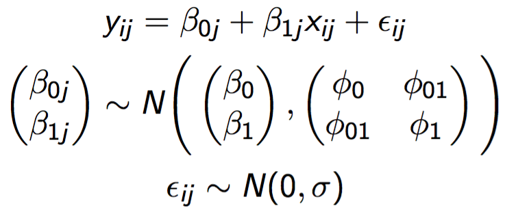
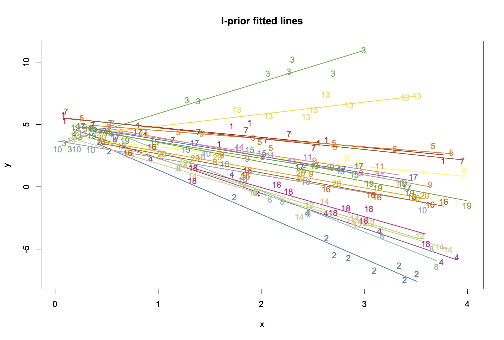
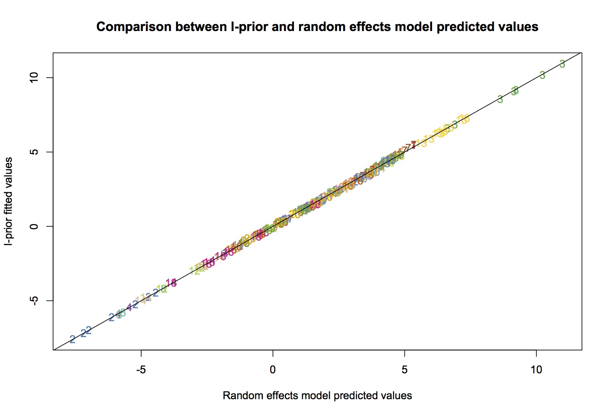

# I-prior modelling with interactions

>**WARNING: `iprior()` function may appear slow or frozen with large datasets. The following examples have been tested and found to be working, for `n=600` roughly.**

There are two ways we can model interactions using I-priors. The first, is the parsimonious method. Here, the scale parameter for the interaction term between `x1` and `x2` is the product between the two scale parameters, i.e. `lambda1*lambda2`. For variables `x1, ..., xp` with all two-way interactions, the number of scale parameters is still `p`.

The second method is to assign another scale parameter to for the interaction terms. Thus, the scale for `x1:x2` is given by `lambda12`, say. The maximum number of parameters is `p + p(p-1)/2`. There are more parameters to be estimated in this method.

The `iprior()` function can now handle both of these methods. The formula call is exactly the same as for `lm()`:
```r
iprior(Hwt ~ Bwt + Sex + Bwt:Sex, data=cats)  #This model includes the interaction between Bwt and Sex
iprior(Hwt ~ (Bwt + Sex)^2, data=cats)        
iprior(Hwt ~ .^2, data=cats)  
```
These are all equivalent calls to the same model. The formula call `^2` models all two-way interactions between the terms. It is useful to use `.^2` as a shorthand, or when it is not known how many variables the dataset contains. The parsimonious interactions method is called by default, but if one wishes to do the second non-parsimonious method, one simply needs to add the option `parsm=F`.

## Example 1 (non-parsimonious method)
A multi-level dataset (j=20 groups, 10 observations per group, thus n=200) was simulated from the following random effects model:



with `beta0=5`, `beta1=-2`, `phi0=2`, `phi1=0.75` and `phi01=1.2`. The error standard deviation was `sigma=0.5`. This dataset is available in the R/iprior package, and it is called `simdat`. 
```r
data(simdat, package="iprior")
summary(simdat)
```

We can fit an I-prior model to this data set as follows:
```r
mod.iprior <- iprior(y ~ x + grp + x:grp, data=simdat, parsm=F)
yhat <- fitted(mod.iprior)
```

Calling `summary(mod.iprior)` reveals the following output:
```r
> summary(mod.iprior)

Call:
iprior.formula(formula = y ~ x + grp + x:grp, data = simdat, parsm = F)

RKHS used:
Canonical (x) 
Pearson (grp) 

Residuals:
    Min.  1st Qu.   Median  3rd Qu.     Max. 
-1.10100 -0.31670 -0.01378  0.29590  1.07000 

            Estimate      S.E.       z  P[|Z>z|]    
alpha      1.9264306 0.0361251 53.3266 < 2.2e-16 ***
lam1.x     0.0744947        NA      NA        NA    
lam2.grp   0.0220941 0.0040996  5.3893 7.072e-08 ***
lam3.x:grp 0.0107189 0.0018804  5.7003 1.196e-08 ***
psi        4.2242287 0.4754694  8.8843 < 2.2e-16 ***
---
Signif. codes:  0 ‘***’ 0.001 ‘**’ 0.01 ‘*’ 0.05 ‘.’ 0.1 ‘ ’ 1

EM converged to within 0.001 tolerance. No. of iterations: 1461
Log-likelihood value: -241.927 

```
*Note: NAs were produced because the the inverse Fisher Information for `x` was negative. Could be because the EM has not converged. Will look into this*

The following code plots the fitted I-prior lines to the dataset.
```r
attach(simdat)
grp <- as.numeric(grp)
plot(x, y, type="n", main="I-prior fitted lines")
for(i in unique(grp)){
	text(x[grp==i], y[grp==i], i, col=i)
	lines(x[grp==i], yhat[grp==i], col=i, lwd=1.5)
}
detach(simdat)
```



We can also look at how the I-prior fitted values compare against the fitted values from a random effects model. The random effects model was fitted in R using the package `lme4`, although many other packages offer multi-level modelling.
```r
mod.re <- lmer(y ~ 1 + x + (1 + x | grp), data=simdat)
yhat.re <- fitted(mod.re)
plot(yhat.re, yhat, type="n", xlab="Random effects model predicted values", ylab="I-prior fitted values", main="Comparison between I-prior and random effects model predicted values")
text(yhat.re, yhat, grp, col=colour[grp], cex=1)
abline(a=0, b=1)
```



Of note, we did also try using the parsimonious method. In this simple example, there is virtually no difference between the two methods. The second example uses the parsimonious method on a real-world dataset.
