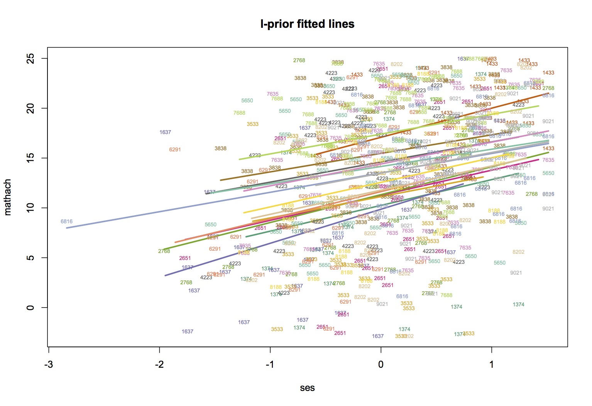
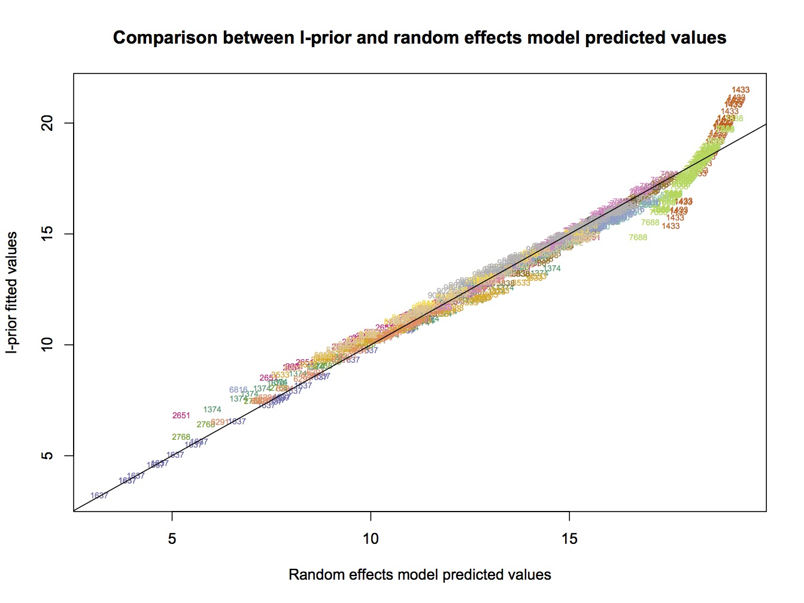

# I-prior modelling with interactions

>**WARNING: `iprior()` function may appear slow or frozen with large datasets. The following examples have been tested and found to be working, for a maximum of `n=600` roughly.**

There are two ways we can model interactions using I-priors. The first, is the parsimonious method. Here, the scale parameter for the interaction term between `x1` and `x2` is the product between the two scale parameters, i.e. `lambda1*lambda2`. For variables `x1, ..., xp` with every two-way interactions possible, the number of scale parameters is still `p`.

The second method is to assign another scale parameter to for the interaction terms. Thus, the scale for `x1:x2` is given by `lambda12`, say. The maximum number of parameters is then `p + p(p-1)/2`. There are more parameters to be estimated in this method, which can be disadvantageous.

The `iprior()` function can now handle both of these methods. The formula call is exactly the same as for `lm()`:
```r
iprior(Hwt ~ Bwt + Sex + Bwt:Sex, data=cats)    #This model includes the 
iprior(Hwt ~ (Bwt + Sex)^2, data=cats)          #interaction between Bwt 
iprior(Hwt ~ .^2, data=cats)                    #and Sex
```
These are all equivalent calls to the same model. The formula call `^2` models all two-way interactions between the terms. It is useful to use `.^2` as a shorthand, or when it is not known how many variables the dataset contains. The parsimonious interactions method is called by default, but if one wishes to do the second non-parsimonious method, one simply needs to add the option `parsm=F`.

## Example 1 (non-parsimonious method)
A multi-level dataset (j=20 groups, 10 observations per group, thus n=200) was simulated from the following random effects model:


with `beta0=5`, `beta1=-2`, `phi0=2`, `phi1=0.75` and `phi01=1.2`. The error standard deviation was `sigma=0.5`. This dataset is available in the R/iprior package, and it is called `simdat`. 
```r
data(simdat, package="iprior")
summary(simdat)
```

We can fit an I-prior model to this data set as follows:
```r
mod.iprior <- iprior(y ~ x + grp + x:grp, data=simdat, parsm=F)
```

Calling `summary(mod.iprior)` reveals the following output:
```r
> summary(mod.iprior)

Call:
iprior.formula(formula = y ~ x + grp + x:grp, data = simdat, parsm = F)

RKHS used:
Canonical (x) 
Pearson (grp) 

Residuals:
    Min.  1st Qu.   Median  3rd Qu.     Max. 
-1.10100 -0.31670 -0.01378  0.29590  1.07000 

            Estimate      S.E.       z  P[|Z>z|]    
alpha      1.9264306 0.0361251 53.3266 < 2.2e-16 ***
lam1.x     0.0371234 0.0236975  1.5665    0.1172    
lam2.grp   0.0220941 0.0040996  5.3893 7.072e-08 ***
lam3.x:grp 0.0107189 0.0018804  5.7003 1.196e-08 ***
psi        4.2242287 0.4754694  8.8843 < 2.2e-16 ***
---
Signif. codes:  0 ‘***’ 0.001 ‘**’ 0.01 ‘*’ 0.05 ‘.’ 0.1 ‘ ’ 1

EM converged to within 0.001 tolerance. No. of iterations: 1461
Log-likelihood value: -241.927 

```

The following code plots the fitted I-prior lines to the dataset.
```r
attach(simdat)
yhat <- fitted(mod.iprior)
grp <- as.numeric(grp)
plot(x, y, type="n", main="I-prior fitted lines")
for(i in unique(grp)){
	text(x[grp==i], y[grp==i], i, col=i)
	lines(x[grp==i], yhat[grp==i], col=i, lwd=1.5)
}
detach(simdat)
```


We can also look at how the I-prior fitted values compare against the fitted values from a random effects model. The random effects model was fitted in R using the package `lme4`, although many other packages offer multi-level modelling.
```r
mod.re <- lmer(y ~ 1 + x + (1 + x | grp), data=simdat)
yhat.re <- fitted(mod.re)
plot(yhat.re, yhat, type="n", xlab="Random effects model predicted values", ylab="I-prior fitted values", main="Comparison between I-prior and random effects model predicted values")
text(yhat.re, yhat, grp, col=colour[grp], cex=1)
abline(a=0, b=1)
```


Of note, we did also try using the parsimonious method. In this simple example, there is virtually no difference between the two methods. The second example uses the parsimonious method on a real-world dataset.

## Example 2 (parsimonious method)
The High School and Beyond is a national longitudinal survey of of students from public and private high schools in the United States, with information such as students' cognitive and non-cognitive skills, high school experiences, work experiences and future plans collected. Papers such as Raudenbush and Bryk (2002) and Raudenbush et. al. (2004) had analyzed this particular dataset, as mentioned in Rabe-Hesketh and Skrondal (2008). 

This dataset contains the variables `mathach`, a measure of mathematics achievement; `ses`, the socioeconomic status of the students based on parental education, occupation and income; and `schoolid`, the school identifier for the students. The original dataset contains 160 groups with varying number of observations per group (n=7185 in total). However, this smaller set contains only 16 randomly selected schools, such that the total sample size is n=661. This was mainly done for computational reasons to illustrate this example.

Begin by loading the dataset and viewing a summary.
```r
data(hsb.small, package="iprior")
summary(hsb.small)
summary(hsb.small$schoolid)
```

We can then fit an I-prior model, with the aim of predicting mathematics achievement `mathach` from the `ses` variable, with the assumption that students' `ses` varied from school to school. In other words, there is an interaction effect between `ses` and `schoolid`.
```r
mod.iprior <- iprior(mathach ~ ses + schoolid + ses:schoolid, data=hsb.small) #parsimonious method by default
```

The summary screen shows us the following:
```r
> summary(mod.iprior)

Call:
iprior.formula(formula = mathach ~ ses + schoolid + ses:schoolid, 
    data = hsb.small)

RKHS used:
Canonical (ses) 
Pearson (schoolid) 

Residuals:
    Min.  1st Qu.   Median  3rd Qu.     Max. 
-17.3000  -4.2220   0.2067   4.4270  15.5500 

                Estimate       S.E.       z  P[|Z>z|]    
alpha         13.7360926  0.2381870 57.6694 < 2.2e-16 ***
lam1.ses       0.4086441  0.1558775  2.6216  0.008753 ** 
lam2.schoolid  0.1319906  0.0268698  4.9122 9.004e-07 ***
psi            0.0280178  0.0015617 17.9406 < 2.2e-16 ***
---
Signif. codes:  0 ‘***’ 0.001 ‘**’ 0.01 ‘*’ 0.05 ‘.’ 0.1 ‘ ’ 1

EM converged to within 0.001 tolerance. No. of iterations: 27
Log-likelihood value: -2137.776 

```

We can produce a plot of fitted lines using the following code, which clearly shows different regression lines for each school:
```r
attach(hsb.small)
yhat <- fitted(mod.iprior)
grp <- as.numeric(schoolid)
plot(ses, mathach, type="n", main="I-prior fitted lines")
for(i in unique(grp)){
	text(ses[grp==i], mathach[grp==i], unique(schoolid)[i], col=i, cex=0.55)
	lines(ses[grp==i], yhat[grp==i], col=i, lwd=2.5)
}
detach(hsb.small)
```



Traditionally, one could also model this dataset using a random effects (random intercept and random slope) model. Let's compare the fitted values of the I-prior model against the random effects model.
```r
mod.re <- lmer(mathach ~ 1 + ses + (1 + ses | schoolid), data=hsb.small)
yhat.re <- fitted(mod.re)
plot(yhat.re, yhat, type="n", xlab="Random effects model predicted values", ylab="I-prior fitted values", main="Comparison between I-prior and random effects model predicted values")
text(yhat.re, yhat, as.character(hsb.small$schoolid), col=colour[grp], cex=0.55)
abline(a=0, b=1)
```



This plot indicates a good agreement between the two models, except perhaps at two particular schools: `schoolid=1433` and `schoolid=7688` indicated by the skewed points at the top right of the plot. The root mean squared error (RMSE) for I-prior is slightly higher than that of the random effects model, 151.7 versus 151.5, respectively.
